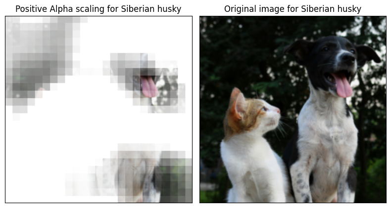
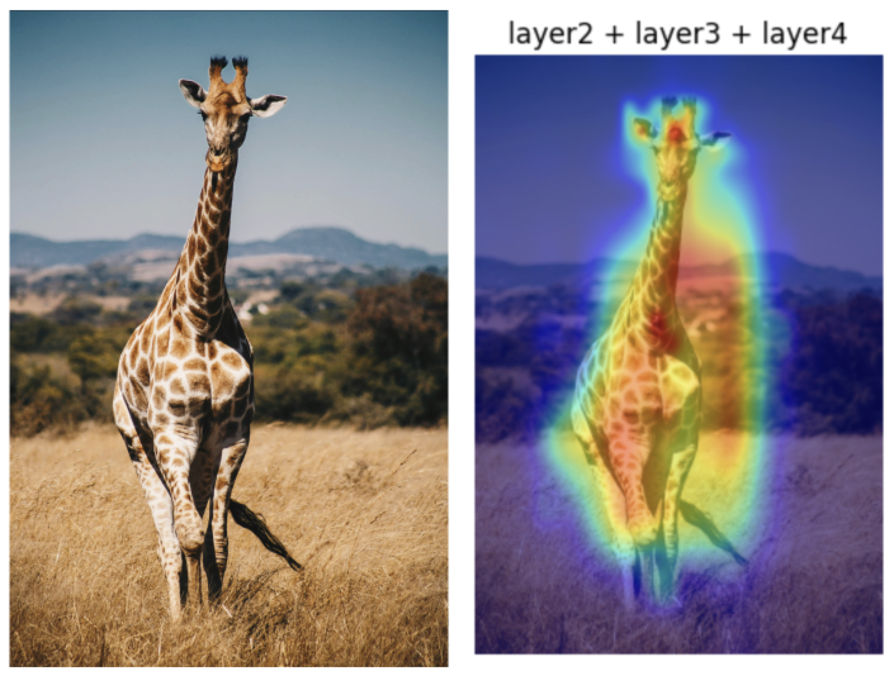
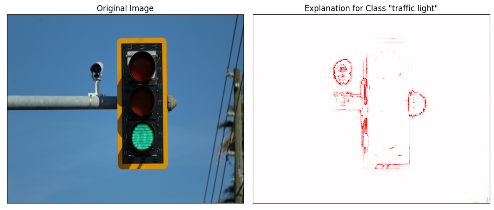

<div align="center">
 
# Easy Explain


[![GitHub][github_badge]][github_link]
[![PyPI][pypi_badge]][pypi_link]
[![Test][test_passing_badge]][test_passing_badge]
[![Licence][licence_badge]][licence_link] 
[![Download][download_badge]][download_link]
[![Download][total_download_badge]][download_link]
[](#supported-python-versions)
[](https://github.com/psf/black) 

**Simplify the Explanation of AI Models**
 
</div>

Unlock the "why" behind your AI models' decisions with `easy-explain`, a Python package designed to democratize access to advanced XAI algorithms. By integrating state-of-the-art explanation techniques with minimal code, we make AI transparency accessible to developers and researchers alike.

> [!IMPORTANT]
> The new versions of `easy-explain` after 0.4.3 have breaking changes. We have changed the logic of different imports to support more models like YoloV8. Have a look at the provided [examples](https://github.com/stavrostheocharis/easy_explain/tree/main/examples).


## Requirements

### Python Versions Supported
- **Primary**: `3.11`
- **Also Supported**: `3.9`, `3.10`

Ensure one of these Python versions is installed on your system to use `easy-explain`.


### Install Environment & Dependencies

`easy-explain` can be seamlessly integrated into your projects with a straightforward installation process:


#### Installation as a Package

To incorporate `easy-explain` into your project as a dependency, execute the following command in your terminal:


```bash
pip install easy-explain
```

## Features and Functionality

`easy-explain` uses under the hood different packages based on the model to be used. [Captum](https://captum.ai/) is used for classification models and it aids to comprehend how the data properties impact the model predictions or neuron activations, offering insights on how the model performs. Captum comes together with [Pytorch library](https://pytorch.org/).
There are also other algorithms supported like GradCam or customade algorithms to support other models like the LRP implementation for YoloV8.


Currently, `easy-explain` specializes in specific cutting-edge XAI methodologies for images:

- Occlusion: For deep insight into classification model decisions.
- Cam: SmoothGradCAMpp & LayerCAM for explainability on image classification models.
- Layer-wise Relevance Propagation (LRP): Specifically tailored for YoloV8 models, unveiling the decision-making process in object detection tasks.

## Quick Start

To begin unraveling the intricacies of your model's decisions, import and utilize the corresponding classes as follows:

```python
from easy_explain import OcclusionExplain

model = 'your-model'

occlusion_explain = OcclusionExplain(model=model)
vis_types=[["blended_heat_map", "original_image"]]
vis_signs = [["positive","all"]]

occlusion_explain.generate_explanation(image_url="your-image",total_preds=5,vis_types = vis_types, vis_signs = vis_signs, labels_path="your-labels-path")

```

```python
from easy_explain import YOLOv8LRP

model = 'your-model'
image = 'your-image'

lrp = YOLOv8LRP(model, power=2, eps=1, device='cpu')

explanation_lrp = lrp.explain(image, cls='your-class', contrastive=False).cpu()

lrp.plot_explanation(frame=image, explanation = explanation_lrp, contrastive=True, cmap='seismic', title='Explanation for your class"')
```

```python
from easy_explain import YOLOv8LRP

model = 'your-model'
image = 'your-image'

trans_params = {"ImageNet_transformation":
  {"Resize": {"h": 224,"w": 224},
  "Normalize": {"mean": [0.485, 0.456, 0.406], "std": [0.229, 0.224, 0.225]}}}

explainer = CAMExplain(model) 

input_tensor = explainer.transform_image(img, trans_params["ImageNet_transformation"])

explainer.generate_explanation(img, input_tensor, multiple_layers=["a_layer", "another_layer", "another_layer"])
```

For more information about how to begin have a look at the [examples notebooks](https://github.com/stavrostheocharis/easy_explain/tree/main/examples).

## Examples

Explore how `easy-explain` can be applied in various scenarios:








## How to contribute?

`easy-explain` thrives on community contributions, from feature requests and bug reports to code submissions. We encourage you to share your insights, improvements, and use cases to foster a collaborative environment for advancing XAI.

### Getting Involved

Submit Issues: Encounter a bug or have a feature idea? Let us know through our  [issues page](https://github.com/stavrostheocharis/easy_explain/issues).

Code Contributions: Interested in contributing code? Please refer to our  [`CONTRIBUTING`](https://github.com/stavrostheocharis/easy_explain/blob/main/CONTRIBUTING.md) guidelines for more information on how to get started..

Join us in making AI models more interpretable, transparent, and trustworthy with `easy-explain`.

## References

1. [easy-explain: Explainable AI for YoloV8](https://pub.towardsai.net/easy-explain-explainable-ai-for-yolov8-bbbf66ff8690)
2. [easy-explain: Explainable AI with GradCam](https://pub.towardsai.net/easy-explain-explainable-ai-with-gradcam-e187f85a697c)
3. [easy-explain: Explainable AI for images](https://pub.towardsai.net/easy-explain-explainable-ai-for-images-285777a004e3)


[github_badge]: https://badgen.net/badge/icon/GitHub?icon=github&color=black&label

[github_link]: https://github.com/stavrostheocharis/easy_explain

[pypi_badge]: https://badge.fury.io/py/easy-explain.svg

[pypi_link]: https://pypi.org/project/easy-explain/

[download_badge]: https://static.pepy.tech/personalized-badge/easy-explain?period=month&units=international_system&left_color=grey&right_color=green&left_text=Monthly%20Downloads

[test_passing_badge]: https://github.com/stavrostheocharis/easy_explain/actions/workflows/python-app.yml/badge.svg

[total_download_badge]: https://static.pepy.tech/personalized-badge/easy-explain?period=total&units=international_system&left_color=grey&right_color=green&left_text=Total%20Downloads

[download_link]: https://pypi.org/project/easy-explain/#files

[licence_badge]: https://img.shields.io/github/license/stavrostheocharis/easy_explain

[licence_link]: LICENSE
